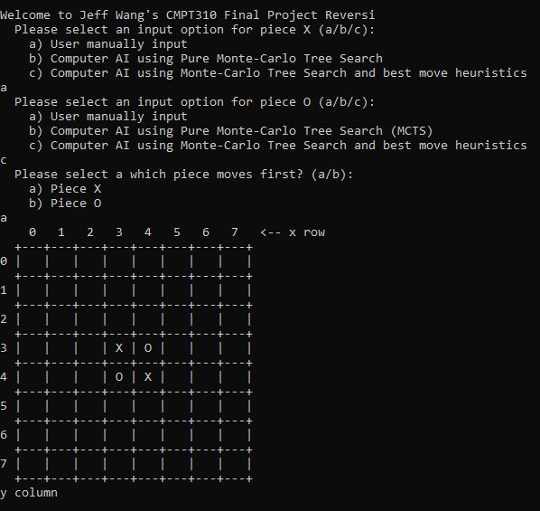
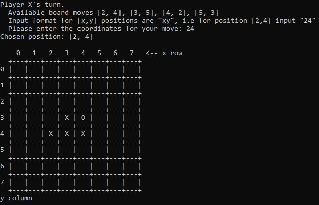
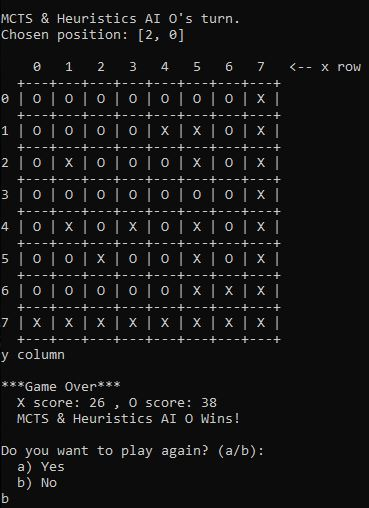

# Reversi AI Final Project
-  Developed a Reversi AI program in Python using Monte-Carlo Tree Search
-  Implemented a custom scoring heuristic on N random playouts to determine the most optimal move for any given board state
-  Wrote automatable test scripts and conducted performance measures to ensure program quality and integrity
-  Conducted data analysis over 1,000 test runs and efficiently transcribed the data into a final written report

## Features

- Users can set input options for X and O pieces 
- Input options: User input, AI using Pure Monte-Carlo Tree Search and AI using Monte-Carlo Tree Search and best move heuristics
- Users can select which piece will move first

## Demo

- Adjust game settings




- User input a move




- End game result




## How to Test

```
$ python3 python3 reversi.py
```
